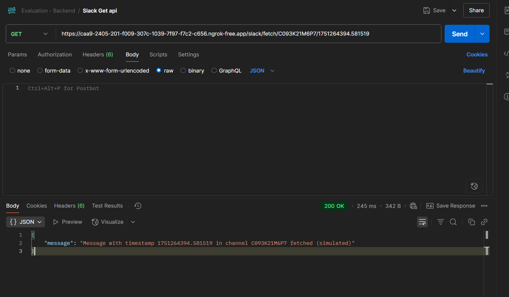
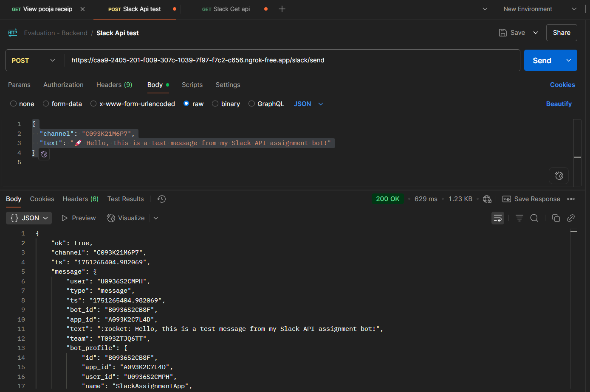

# 🚀 Slack API Assignment - Messaging Bot (Node.js + Express)

This project is a Slack messaging bot built with Node.js and Express. It allows users to **send**, **schedule**, **update**, **delete**, and **simulate fetch** of messages to a Slack channel using Slack's Web API and OAuth 2.0 flow.

---

## 📌 Features

- 🔐 Slack OAuth2.0 authentication (install app to workspace)
- 💬 Send real-time messages to Slack channels
- 🕒 Schedule messages using timestamps
- ✏️ Update existing Slack messages
- ❌ Delete messages (via timestamp)
- 🔎 Simulated fetch message API
- 🧪 Modular routes, controller logic, and `.env` configuration support

---

## 🧱 Tech Stack

- Node.js
- Express.js
- Slack Web API
- Axios
- dotenv
- ngrok (for local HTTPS tunneling)

---

## 📂 Project Structure

slack-assignment/
│
├── index.js               # Main server entry point
├── .env                   # Environment variables (excluded from Git)
├── package.json
│
├── routes/
│   └── slack.js           # API route handlers for Slack operations
│
└── utils/
    └── slackClient.js     # Functions for interacting with Slack API

---

## ⚙️ Setup Instructions

### 1. Clone the Project

    git clone https://github.com/your-username/slack-assignment.git
    cd slack-assignment

### 2. Install Dependencies

    npm install

### 3. Create `.env` File

Replace values with your actual keys from the Slack Developer Dashboard:

    SLACK_CLIENT_ID=your_client_id
    SLACK_CLIENT_SECRET=your_client_secret
    SLACK_BOT_TOKEN=your_bot_token
    SLACK_SIGNING_SECRET=your_signing_secret
    REDIRECT_URI=https://your-ngrok-url.ngrok-free.app/slack/oauth/callback
    PORT=3000

### 4. Start the Local Server

    node index.js

Should show:

    ✅ Server running on http://localhost:3000

### 5. Start Ngrok

    ngrok http 3000

Copy the HTTPS URL from ngrok and use it in:
- `.env` → `REDIRECT_URI`
- Slack App → OAuth & Permissions → Redirect URLs

---

## 🔐 Slack OAuth URL

Use this (replace your client ID and redirect):

    https://slack.com/oauth/v2/authorize?client_id=YOUR_CLIENT_ID&scope=chat:write,chat:write.public,chat:write.customize,channels:read,groups:read,channels:history&redirect_uri=YOUR_REDIRECT_URI

---

## 📮 API Endpoints

| Method | Route                            | Description                  |
|--------|----------------------------------|------------------------------|
| GET    | /slack/oauth/callback            | OAuth install handler        |
| POST   | /slack/send                      | Send a message               |
| POST   | /slack/schedule                  | Schedule a message           |
| POST   | /slack/update                    | Update a message             |
| POST   | /slack/delete                    | Delete a message             |
| GET    | /slack/fetch/:channel/:ts        | Simulate fetching a message  |

---

## 🧪 Sample JSON for Testing

POST /slack/send
```json
{
  "channel": "C01234567",
  "text": "Hello from my bot!"
}


POST /slack/update
{
"channel": "C01234567",
"ts": "1234567890.123456",
"text": "Updated message"
}
```
---

###📸 Screenshots







---

## 🙋‍♂️ Author

<h3><strong>Akshay A.</strong></h3>
<p><strong>MERN Stack Developer</strong></p>

<p>
  <strong>Portfolio:</strong> <a href="https://portfolio-akshay-244.vercel.app" target="_blank">portfolio-akshay-244.vercel.app</a><br>
  <strong>LinkedIn:</strong> <a href="https://www.linkedin.com/in/akshay-a-023a472a4" target="_blank">linkedin.com/in/akshay-a-023a472a4</a><br>
  <strong>GitHub:</strong> <a href="https://github.com/me32face" target="_blank">github.com/me32face</a>
</p>

